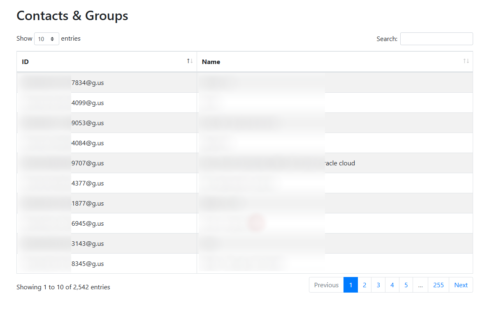
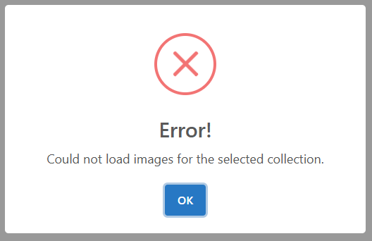
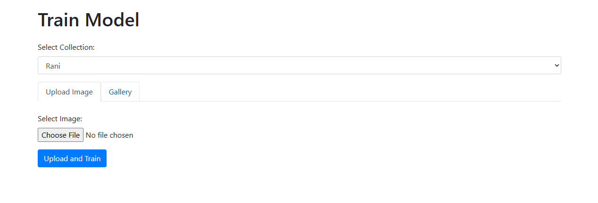
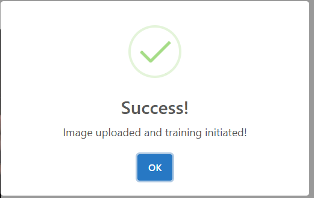
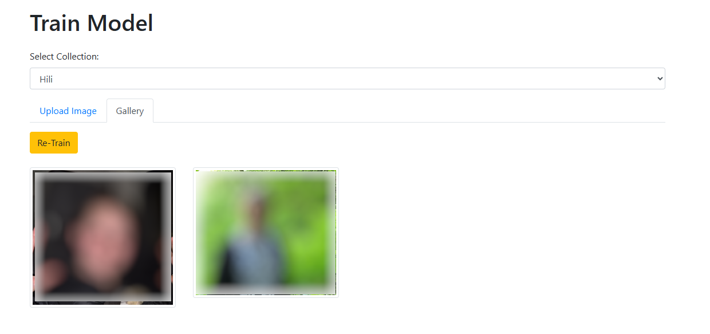

# Find My Kids - WhatsApp Face Recognition Bot

This application uses AWS Rekognition and WhatsApp Green API to detect and notify when specific faces appear in images sent to a WhatsApp group.

## Prerequisites

- [Docker and Docker Compose installed](https://medium.com/@tomer.klein/step-by-step-tutorial-installing-docker-and-docker-compose-on-ubuntu-a98a1b7aaed0)
- [AWS Account](https://signin.aws.amazon.com/signup?request_type=register)
- [Green API Account](https://green-api.com/)

## Setup Instructions

### 1. AWS Account Setup

#### Create an AWS Account
1. Go to [AWS Sign Up](https://signin.aws.amazon.com/signup?request_type=register)
2. Follow the registration process
3. Complete the account verification

#### Create IAM User and Access Keys
1. Sign in to the AWS Management Console
2. Navigate to IAM (Identity and Access Management)
3. Click on "Users" in the left navigation pane
4. Click "Create user"
5. Enter a username (e.g., `find-my-kids-bot`)
6. Select "Access key - Programmatic access"
7. Click "Next: Permissions"
8. Click "Attach existing policies directly"
9. Search for and select "AmazonRekognitionFullAccess"
10. Click "Next: Tags" (optional)
11. Click "Next: Review"
12. Click "Create user"
13. **IMPORTANT**: Download the CSV file containing your access key and secret key

[](https://www.youtube.com/watch?v=lIdh92JmWtg)


### 2. Green API Setup

#### Create a Green API Account
1. Go to [Green API](https://green-api.com/)
2. Click "Sign Up" and create an account
3. Verify your email address

#### Get API Credentials
1. Log in to your Green API account
2. Go to "API Settings"
3. Create a new instance
4. Note down your:
   - Instance ID
   - API Token

#### ***Important Note:***
Do not set webhook url for your instance, otherwise the bot will not work.


### 3. Environment Setup

1. Copy the `.env.example` file to `.env`:
   ```bash
   cp .env.example .env
   ```

2. Edit the `.env` file with your credentials:
   ```
   # AWS Credentials
   AWS_REGION=your_aws_region
   AWS_KEY=your_aws_access_key
   AWS_SECRET=your_aws_secret_key

   # WhatsApp API Credentials
   GREEN_API_INSTANCE=your_whatsapp_instance_id
   GREEN_API_TOKEN=your_whatsapp_api_token
   ```

### 4. Running the Application

1. Pull the latest image:
   ```bash
   docker-compose pull
   ```

2. Start the application:
   ```bash
   docker-compose up -d
   ```

3. The application will be available at `http://[Server_IP]:[Port]`

## Usage

### Configuration file
Under the config folder you will find a file named *config.yaml* with the following content:

```yaml
kids:
  Kid1: 
    collection_id: Kid1
    chat_ids:
      - 000000000000000000@g.us

target: 972000000000-1000000000@g.us
```

* Kid1 is the name of the kid/person
* collection_id: The Id of the collection in AWS rekognition.
* chat_ids: list of whatsapp chats (Groups or Contacts) to monitor.
* target: The target group or contact to forward the pictures to.

In order to get the list of groups, enter the following URL: http://[server_ip]:[port]/contacts

The web page will contain a table with the list of contacts and group:



**After updating the config file, restart the container to reload the configuration**

### Training
In order to train the Rekognition model open your browser and navigate to: http://[SERVER_IP]:[PORT]/trainer

An error may popup, it is because there are no images related for the collections, just click on OK.


Next, select the collecion you would like to train, Select a picture and click "Upload and Train" button:





In the Gallery tab, you will see all the pictured used to train the model:


You can click the "re-train" button to re-train the model with the pictures.